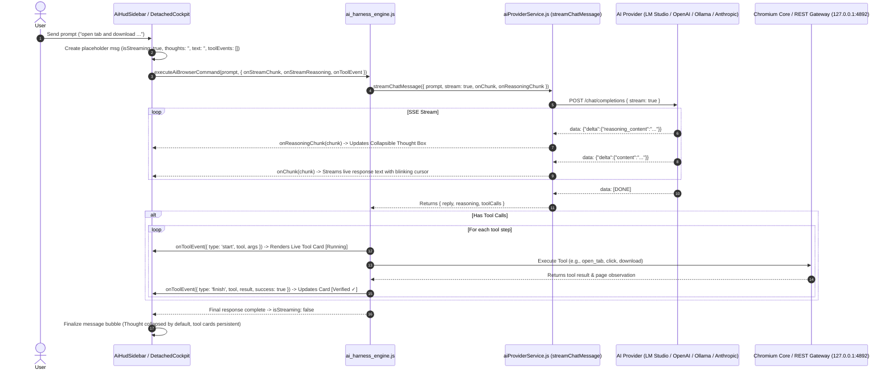

# Implementation Plan - Streaming AI Responses, Live Thinking/Reasoning & Antigravity-Style Tool Execution UI

Add full ChatGPT, Gemini, and Claude style response streaming and live thinking/reasoning to the Antigravity native browser AI Copilot and autonomous agent loop. The UI will feature a collapsible thought container with duration timing and retract/expand controls, live token-by-token content streaming, and Antigravity-style interactive tool cards that report live tool invocations, inputs, execution status, and verified page observations.

---

## User Review Required

> [!IMPORTANT]
> 1. **Zero-Bloat Native Streaming**: Uses standard Web `ReadableStream` (`res.body.getReader()`) with `TextDecoder` (strictly zero third-party dependencies or external SSE packages).
> 2. **Multi-Provider Thinking / Reasoning Support**:
>    - Captures `delta.reasoning_content` and `delta.reasoning` from OpenAI-compatible providers (DeepSeek-R1, LM Studio, Ollama, OpenRouter).
>    - Captures `thinking_delta` and `text_delta` from Anthropic Claude 3.7 / Sonnet.
> 3. **Collapsible Thought Box with Retract Button**:
>    - Displays live thinking stream inside a styled glassmorphic box with a live pulsing indicator and elapsed timer (`Thought for X seconds`).
>    - Features an explicit **Retract / Expand** toggle button (`▼ Collapse Thought` / `▶ Expand Thought`).
>    - Retracts automatically upon completion of the thinking phase so the final response and tool cards take prominence, while remaining expandable at any time.
> 4. **Live Tool Usage & Antigravity-Style Action Cards**:
>    - When the AI invokes a browser tool (e.g., `open_tab`, `navigate`, `click_element`, `download_item`, `verify_download`, `remind_user`), an interactive card renders in the stream:
>      - **Tool Name & Icon** (e.g. `⚡ open_tab`, `🔍 search_page`, `📥 download_item`)
>      - **Input Arguments** formatted in clean JSON.
>      - **Live Status Badge**: `[⚡ Running...]` ➔ `[✓ Verified]` or `[✗ Error]`.
>      - **Observation Summary**: Live feedback of page URL, elements matched, or downloaded file details.
> 5. **Generation Controls**:
>    - Includes an active **Stop Generation** button (`⏹ Stop`) during streaming backed by an `AbortController`.

---

## Proposed Architecture & Component Flow

---

## Proposed Changes

### AI Service & Harness Layer

#### [MODIFY] [`aiProviderService.js`](file:///c:/Users/Anurag/Desktop/automated%20browser/desktop/src/services/aiProviderService.js)
- Implement `streamChatMessage({ prompt, imagePath, imageBase64, systemPrompt, history, tools, onChunk, onReasoningChunk, signal })`.
- Native SSE parser with `ReadableStream` reader and `TextDecoder`.
- Parse OpenAI-compatible SSE chunk deltas:
  - `choice.delta.content`: dispatch to `onChunk(delta.content)`.
  - `choice.delta.reasoning_content` / `choice.delta.reasoning`: dispatch to `onReasoningChunk(delta.reasoning_content)`.
  - `choice.delta.tool_calls`: accumulate chunked tool calls (arguments JSON and function names).
- Parse Anthropic SSE event stream (`text_delta`, `thinking_delta`, `input_json_delta`).
- Return aggregated `{ success: true, reply, reasoning, toolCalls, provider, model }`.

#### [MODIFY] [`ai_harness_engine.js`](file:///c:/Users/Anurag/Desktop/automated%20browser/desktop/src/ai_harness_engine.js)
- Update `executeAiBrowserCommand` and `executeAutonomousAgentLoop` to accept streaming callbacks:
  - `onStreamChunk`: real-time text token forwarding.
  - `onStreamReasoning`: real-time thinking token forwarding.
  - `onToolEvent`: live dispatch of tool invocation events (`{ id, tool, args, status: 'running' | 'completed' | 'failed', result, observation, durationMs }`).
- In autonomous loop turns, stream live thoughts and action notices directly into the active UI bubble.

---

### UI / HUD Component Layer

#### [MODIFY] [`AiHudSidebar.jsx`](file:///c:/Users/Anurag/Desktop/automated%20browser/desktop/src/components/AiHudSidebar.jsx)
- **State Updates in Messages**:
  - Each assistant message stores:
    - `text`: string (live streamed)
    - `reasoning`: string (live streamed thinking)
    - `isStreaming`: boolean
    - `isThinking`: boolean
    - `thoughtDuration`: number (elapsed thinking time in seconds)
    - `thoughtCollapsed`: boolean (default false while thinking, true after final text begins)
    - `toolEvents`: array of live tool cards `[{ id, name, args, status, result, observation, collapsed }]`
- **ChatGPT/Claude/Gemini-Style Thought Box**:
  - Glassmorphic inset box with animated thinking header:
    - Pulsing cyan/violet glowing indicator.
    - Duration timer: `Thought for 3.2s`.
    - Retract / Expand toggle button (`▼ Collapse Thought` / `▶ Thought for 3.2s`).
    - Monospace/italic text block displaying the live streamed reasoning.
- **Antigravity-Style Tool Cards**:
  - Dedicated card rendered right above or alongside the response:
    - Header: Tool badge, tool name, status pill (`⚡ Running...` / `✓ Verified`).
    - Body: Expandable JSON arguments view and verification observation results.
    - Retract / Expand toggle for tool details.
- **Active Generation Controls**:
  - `⏹ Stop Generation` button visible in the input bar while `isStreaming` is active, connected to `AbortController`.
  - Typing caret animation (`▋`) while streaming.

#### [MODIFY] [`DetachedAiHudCockpit.jsx`](file:///c:/Users/Anurag/Desktop/automated%20browser/desktop/src/components/DetachedAiHudCockpit.jsx)
- Mirror the Thought Box, Retract Button, Tool Cards, and streaming display for the detached multi-window cockpit.

#### [MODIFY] [`App.jsx`](file:///c:/Users/Anurag/Desktop/automated%20browser/desktop/src/App.jsx)
- Support streaming IPC events from the main window to the detached HUD (`hud-stream-chunk`, `hud-stream-reasoning`, `hud-tool-event`).

---

## Verification Plan

### Automated Verification
- Create test script `tests/test_response_streaming.js`:
  - Connects to the local AI provider (or mock SSE stream).
  - Verifies token-by-token emission of `onChunk` and `onReasoningChunk`.
  - Verifies live tool event callbacks (`onToolEvent`).
- Run React bundle build:
  - `npm run build:react` to verify clean JSX compilation with zero syntax or bundling errors.

### Live Visual & Interactive Verification
- Launch the native desktop application (`npm start`).
- In the AI Copilot chat:
  - Enter a query that prompts reasoning (e.g. "What is the best way to download files safely from moviesmod?").
  - Verify live token-by-token streaming of the response.
  - Verify the **Thought Box** renders, streams thoughts, tracks duration, and can be retracted/expanded with the **Retract** button.
  - Enter an autonomous browser command: "open a new tab and open moviesmod.zone".
  - Verify the **Antigravity Tool Card** renders with `⚡ open_tab`, parameters, and live `[✓ Verified]` state.
- Capture a screenshot of the browser UI showing the live streaming thought box and tool cards to save as visual proof in the artifacts directory.
