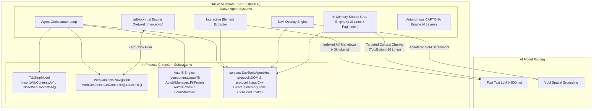

```mermaid
flowchart TD
    subgraph HostEngine ["Native AI Browser Core (Option C)"]
        subgraph InProcessControl ["In-Process Chromium Subsystems"]
            TSM["TabStripModel<br/>InsertWebContentsAt() / CloseWebContentsAt()"]
            NAV["WebContents Navigation<br/>WebContents::GetController().LoadURL()"]
            AF["Autofill Engine (components/autofill)<br/>AutofillManager::FillForm()<br/>AutofillProfile / FormStructure"]
            DTAH["content::DevToolsAgentHost<br/>protocol::DOM & protocol::Input C++<br/>Direct in-memory calls (Zero Port Leaks)"]
        end
        subgraph AgentOrchestrator ["Native Agent Systems"]
            ORCH["Agent Orchestrator Loop"]
            EXT["Interactive Element Extractor"]
            SOM["SoM Overlay Engine"]
            GREP["In-Memory Source Grep Engine (±10 Lines + Pagination)"]
            ADB["adblock-rust Engine (Network Interceptor)"]
            CAP["Autonomous CAPTCHA Engine (4 Layers)"]
        end
    end
    
    ORCH --> TSM
    ORCH --> NAV
    ORCH --> AF
    ORCH --> DTAH
    EXT --> DTAH
    SOM --> DTAH
    GREP --> DTAH
    ADB <-->|Zero-Copy Filter| NAV
    
    subgraph ModelRouting ["AI Model Routing"]
        EXT -->|"Indexed AX Markdown (<3k tokens)"| LLM["Fast Text LLM (<500ms)"]
        SOM -->|"Annotated SoM Screenshot"| VLM["VLM Spatial Grounding"]
        GREP -->|"Targeted Context Chunks (Top/Bottom 10 Lines)"| LLM
    end
```
